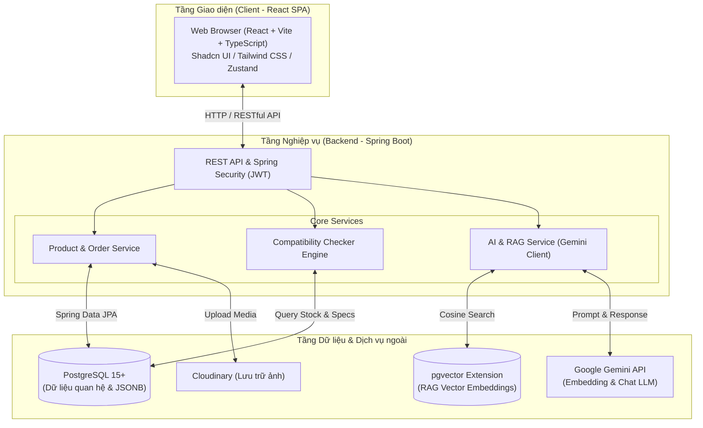
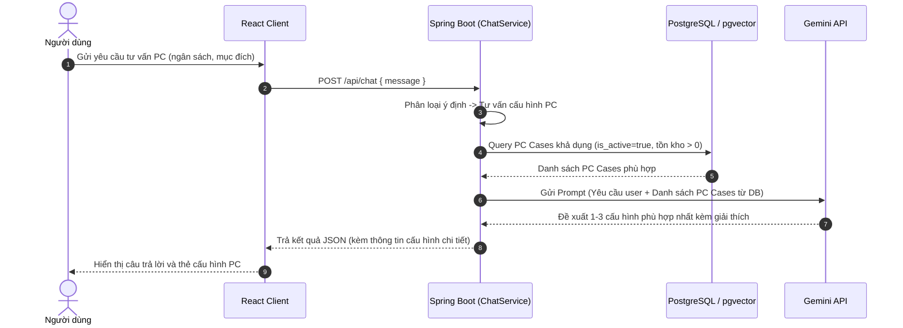
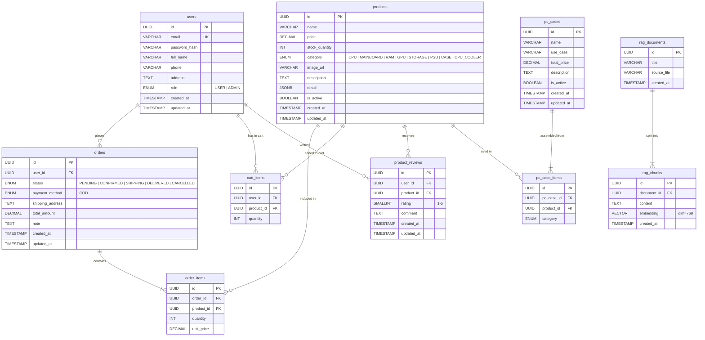

<!-- trang 1 -->
# Thiết Kế Phần Mềm

cho

&lt;Dự Án&gt;

Phiên bản X.X được phê chuẩn

Được chuẩn bị bởi

Thành viên 1 - MSSV  
Thành viên 2 - MSSV  
Thành viên 3 - MSSV

21/09/2026

&lt;Tổ chức&gt;

&lt;Ngày tạo ra tài liệu&gt;

<!-- trang 2 -->

Theo dõi phiên bản tài liệu

| **Tên** | **Ngày** | **Lý do thay đổi** | **Phiên bản** |
| ------- | -------- | ------------------ | ------------- |
|         |          |                    |               |
|         |          |                    |               |

<!-- trang 3 -->

# Giới thiệu

## Mục đích

&lt;Xác định mục tiêu của tài liệu này và đối tượng dự định đọc nó. (VD: Tài liệu thiết kế phần mềm này mô tả thiết kế kiến trúc và thiết kế chi tiết của XX…).&gt;

## Phạm vi

&lt;Viết mô tả và phạm vi của phần mềm và giải thích các lợi ích, mục đích và mục tiêu của dự án.&gt;

## Bảng chú giải thuật ngữ

<

- Đây là mục tùy chọn
- Định nghĩa các từ viết tắt, các thuật ngữ được sử dụng trong tài liệu mà chúng gần như không được biết đến bởi người đọc.

| STT | Thuật ngữ / Từ viết tắt | Định nghĩa / Giải thích |
| --- | ----------------------- | ----------------------- |
|     |                         |                         |

\>

## Tài liệu tham khảo

<

- Đây là mục tùy chọn
- Liệt kê ra bất cứ tài liệu hay địa chỉ website nào mà tài liệu này tham khảo tới. Cung cấp đủ thông tin để người đọc có thể tìm bản sao của từng tài liệu tham khảo, bao gồm: tiêu đề, tác giả, số phát hành, ngày, nguồn hay nơi cung cấp. >

## Tổng quan về tài liệu

&lt;Cung cấp một cái nhìn tổng quan về tài liệu này và sự tổ chức của nó.&gt;

# Tổng quan hệ thống

## 1. Ngữ cảnh và Mục tiêu đề tài
Hệ thống **"Ứng dụng web bán linh kiện máy tính tích hợp AI hỗ trợ gợi ý cấu hình"** là một đồ án niên luận ngành Công nghệ thông tin / Kỹ thuật phần mềm. Dự án hướng tới việc xây dựng một website thương mại điện tử chuyên doanh linh kiện máy tính, kết hợp trợ lý Trí tuệ nhân tạo (AI) nhằm giải quyết khó khăn lớn nhất của khách hàng phổ thông: **tính tương thích phần cứng phức tạp** và **lựa chọn cấu hình PC tối ưu theo ngân sách và nhu cầu**.

## 2. Các chức năng cốt lõi
Hệ thống gồm 3 phân hệ chính:
1. **Phân hệ Thương mại điện tử (E-commerce Core)**:
   - Tra cứu, tìm kiếm, lọc linh kiện theo đặc tính kỹ thuật riêng biệt (CPU, Mainboard, RAM, GPU, Storage, PSU, Case, Tản nhiệt).
   - Quản lý giỏ hàng, đặt hàng thanh toán khi nhận hàng (COD), theo dõi lịch sử đơn hàng.
   - Đánh giá sản phẩm đã mua (1–5 sao kèm nhận xét).
2. **Phân hệ Trợ lý ảo AI (AI Chatbot Service)**:
   - **Hỏi đáp chính sách (RAG)**: Sử dụng kỹ thuật Retrieval-Augmented Generation kết hợp vector similarity search (`pgvector`) và Gemini API để giải đáp chính sách bảo hành, đổi trả, vận chuyển từ tài liệu cửa hàng.
   - **Tư vấn gợi ý cấu hình PC**: Nhận mô tả ngôn ngữ tự nhiên từ người dùng về ngân sách và mục đích sử dụng (gaming, đồ họa, văn phòng...), phân tích và gợi ý 1–3 bộ PC Case hoàn chỉnh có sẵn trong hệ thống (đã được kiểm tra tương thích và còn hàng).
3. **Phân hệ Quản trị (Admin Panel)**:
   - Quản lý danh mục linh kiện (thông số kỹ thuật lưu dạng JSONB linh hoạt).
   - Quản lý và xử lý đơn hàng.
   - Thiết lập cấu hình PC Case (tích hợp thuật toán tự động kiểm tra tương thích phần cứng trước khi lưu).
   - Quản lý tài liệu tri thức RAG và xem báo cáo thống kê kinh doanh cơ bản.

## 3. Các nhóm người dùng (Actors)
- **Guest (Khách vãng lai)**: Xem danh mục sản phẩm, xem đánh giá, trò chuyện với Chatbot AI, đăng ký tài khoản.
- **User (Khách hàng)**: Kế thừa quyền Guest; đăng nhập, quản lý giỏ hàng, đặt hàng COD, xem trạng thái đơn hàng, viết đánh giá sản phẩm đã mua.
- **Admin (Quản trị viên)**: Kế thừa quyền User; quản lý sản phẩm, đơn hàng, xây dựng PC Case, nạp tài liệu RAG, xem thống kê.

# Kiến trúc hệ thống

## Thiết kế kiến trúc

### 1. Sơ đồ kiến trúc tổng thể
Hệ thống được thiết kế theo mô hình **Client - Server (3 tầng / 3-Tier Layered Architecture)** tách rời giữa giao diện người dùng và xử lý nghiệp vụ, giao tiếp thông qua RESTful API chuẩn:

### 2. Các thành phần chính và trách nhiệm
- **Client (Frontend - React + Vite + TypeScript)**: Ứng dụng Single Page Application (SPA), chịu trách nhiệm kết xuất giao diện người dùng, điều hướng trang, xử lý tương tác, quản lý giỏ hàng phía client và gọi API tới Backend qua Axios.
- **Backend (Spring Boot / Java)**: Đóng vai trò là trung tâm xử lý toàn bộ logic nghiệp vụ, quản lý phiên và phân quyền bằng JWT, thực thi thuật toán kiểm tra tính tương thích của linh kiện, điều phối luồng hỏi đáp RAG và gợi ý cấu hình PC.
- **Cơ sở dữ liệu (PostgreSQL + pgvector)**: Lưu trữ tập trung dữ liệu quan hệ (người dùng, sản phẩm, đơn hàng, PC Case) và bảng vector embedding (các đoạn tài liệu chính sách cửa hàng) để tìm kiếm tương đồng.
- **Dịch vụ tích hợp bên ngoài**:
  - **Google Gemini API**: Sinh vector nhúng (embedding) và tạo nội dung phản hồi ngôn ngữ tự nhiên.
  - **Cloudinary**: Lưu trữ và phân phối hình ảnh linh kiện máy tính.

### 3. Những lựa chọn kiến trúc đã xem xét
- **Kiến trúc Nguyên khối truyền thống (Monolithic SSR - JSP / Thymeleaf)**:
  - *Đánh giá*: Dễ triển khai ban đầu trên cùng một project Spring Boot.
  - *Lý do không chọn*: Giao diện tải lại toàn trang gây gián đoạn trải nghiệm người dùng (đặc biệt với widget chat AI cần phản hồi mượt mà), khó chia việc song song cho các thành viên phụ trách Frontend và Backend.
- **Kiến trúc Vi dịch vụ (Microservices)**:
  - *Đánh giá*: Chia nhỏ các chức năng thành nhiều service độc lập (Auth Service, Product Service, Order Service, AI Service...).
  - *Lý do không chọn*: Quá phức tạp trong việc triển khai hạ tầng, giao tiếp mạng nội bộ và đồng bộ dữ liệu; không cần thiết với quy mô đề tài niên luận của sinh viên.
- **Lựa chọn áp dụng: Kiến trúc Phân tầng Client - Server (React SPA + Spring Boot REST API)**:
  - Tách bạch rõ ràng giữa tầng giao diện và tầng nghiệp vụ, phát triển độc lập dễ dàng, tái sử dụng API tốt, cấu trúc gọn gàng, phù hợp nhất với năng lực và mục tiêu học tập.

## Mô tả sự phân rã

Hệ thống được phân rã thành các phân hệ và gói thành phần (Package/Module) rõ ràng theo từng tầng trách nhiệm:

### 1. Phân hệ Client (Frontend)
- **Auth Module**: Đăng ký, đăng nhập, lưu trữ token, bảo vệ các tuyến đường yêu cầu quyền hạn (Route Guards).
- **Product Module**: Trang danh sách sản phẩm, lọc theo phân loại & thuộc tính kỹ thuật, trang chi tiết linh kiện.
- **Cart & Checkout Module**: Quản lý giỏ hàng (Zustand), nhập địa chỉ nhận hàng và tạo đơn hàng COD.
- **Chatbot AI Module**: Widget chat giao tiếp thời gian thực, hiển thị câu trả lời chính sách hoặc thẻ PC Case gợi ý.
- **Admin Module**: Quản lý linh kiện, quản lý trạng thái đơn hàng, giao diện tạo PC Case (chọn 8 linh kiện thành phần), upload tài liệu RAG và xem biểu đồ thống kê.

### 2. Phân hệ Backend (Spring Boot Services)
Backend được tổ chức theo mô hình chuẩn Controller - Service - Repository:

| Module / Service | Trách nhiệm chính |
| :--- | :--- |
| `AuthService` | Xử lý mã hóa mật khẩu (BCrypt), cấp phát và xác thực JWT token (Access/Refresh Token). |
| `ProductService` | Quản lý CRUD linh kiện, truy vấn linh kiện theo danh mục và thuộc tính trong trường `detail` (JSONB). |
| `CartService` & `OrderService` | Quản lý sản phẩm trong giỏ, tạo đơn hàng COD, trừ tồn kho và cập nhật trạng thái đơn. |
| `CompatibilityCheckerService` | **Bộ máy kiểm tra tương thích phần cứng**, xác thực 8 quy tắc kỹ thuật nghiêm ngặt trước khi cho phép lưu cấu hình PC Case (Socket, Form factor, RAM type, GPU length, Cooler height, Cooler socket, PSU wattage/TDP, và tồn kho linh kiện). |
| `PcCaseService` | Quản lý các bộ cấu hình máy tính hoàn chỉnh do Admin tạo. |
| `RagService` | Tiếp nhận tài liệu, chia đoạn (chunking), tạo embedding qua Gemini API, lưu vào `pgvector` và truy vấn cosine similarity. |
| `PcConfigSuggestionService` | Lọc các PC Case khả dụng trong DB, nhồi vào prompt gửi Gemini API để chọn cấu hình phù hợp với yêu cầu người dùng. |
| `ChatService` | Điều phối tiếp nhận tin nhắn từ người dùng, phân loại intent (hỏi chính sách hay nhờ gợi ý PC) để chuyển đến service tương ứng. |
| `StatisticsService` | Truy vấn và tổng hợp các số liệu báo cáo doanh thu, đơn hàng cho Admin. |

### 3. Luồng cộng tác tiêu biểu giữa các hệ thống con

## Cơ sở thiết kế

Kiến trúc và giải pháp công nghệ của hệ thống được lựa chọn dựa trên các tiêu chí đơn giản, ổn định, dễ hiện thực cho mục đích học tập:

1. **Sử dụng PostgreSQL tích hợp `pgvector` thay vì Vector Database rời**:
   - Thay vì phải cài đặt và vận hành thêm một hệ thống cơ sở dữ liệu vector chuyên dụng (như Milvus hay Pinecone), việc tích hợp extension `pgvector` vào PostgreSQL giúp toàn bộ dữ liệu quan hệ và vector embeddings nằm chung trong một hệ quản trị CSDL duy nhất. Điều này giảm đáng kể chi phí hạ tầng, dễ cấu hình và sao lưu dữ liệu trong môi trường học tập.
2. **Lưu trữ thông số kỹ thuật linh kiện bằng kiểu dữ liệu JSONB**:
   - Mỗi linh kiện phần cứng (CPU, RAM, GPU, Nguồn...) có các trường thông số rất khác biệt. Nếu áp dụng thiết kế quan hệ truyền thống sẽ cần tạo hàng chục bảng riêng hoặc mô hình EAV (Entity-Attribute-Value) phức tạp. Việc sử dụng cột `detail` dạng `JSONB` trong PostgreSQL giúp lưu trữ linh hoạt, dễ mở rộng thêm thông số kỹ thuật mới mà vẫn hỗ trợ lập chỉ mục (index) và truy vấn tốt.
3. **Chiến lược gợi ý cấu hình PC dựa trên mẫu tạo sẵn (Anti-hallucination Design)**:
   - Mô hình ngôn ngữ lớn (LLM) dễ gặp hiện tượng "ảo giác" (tự bịa đặt thông số hoặc ghép các linh kiện không tương thích như CPU Intel socket LGA1700 vào bo mạch chủ AMD AM5).
   - *Quyết định thiết kế*: Admin là người thiết lập các bộ cấu hình mẫu (PC Case), được thuật toán Backend kiểm định tính tương thích tuyệt đối. Chatbot AI chỉ đóng vai trò phân tích ngôn ngữ tự nhiên của người dùng và lựa chọn bộ cấu hình thích hợp nhất từ tập hợp cấu hình có sẵn này. Giải pháp này đảm bảo tính khả thi thực tế 100% của cấu hình được gợi ý.
4. **Các thỏa hiệp thiết kế (Design Trade-offs)**:
   - *Thanh toán*: Chỉ hỗ trợ thanh toán khi nhận hàng (COD), giản lược việc tích hợp cổng thanh toán trực tuyến (VNPay/MoMo) để tập trung nguồn lực vào bài toán tương thích linh kiện và tính năng AI.
   - *Kiến trúc tổng thể*: Sử dụng kiến trúc Client - Server nguyên khối cho Backend (Monolithic Backend) thay vì Microservices để giữ mã nguồn gọn gàng, kiểm thử thuận tiện và phù hợp với thời lượng một học phần niên luận.

# Thiết kế dữ liệu

## Mô tả dữ liệu

### 1. Chiến lược tổ chức và lưu trữ dữ liệu
Miền thông tin của hệ thống được mô hình hóa và lưu trữ tập trung trên hệ quản trị cơ sở dữ liệu **PostgreSQL 15+** kết hợp tiện ích mở rộng **pgvector**, phân bổ theo 3 hình thức lưu trữ tối ưu cho đề tài học tập:

1. **Dữ liệu quan hệ chuẩn (Relational Tables)**:
   - Quản lý các đối tượng kinh doanh cốt lõi: tài khoản người dùng (`users`), đơn hàng (`orders`, `order_items`), giỏ hàng (`cart_items`), đánh giá (`product_reviews`) và cấu hình máy tính (`pc_cases`, `pc_case_items`).
   - Các bảng được chuẩn hóa (3NF), thiết lập khóa chính (UUID), khóa ngoại và các ràng buộc toàn vẹn nhằm đảm bảo tính nhất quán dữ liệu.
2. **Dữ liệu bán cấu trúc (Semi-structured Data - JSONB)**:
   - Bảng sản phẩm (`products`) sử dụng cột `detail` kiểu `JSONB` để lưu trữ các thông số kỹ thuật đặc thù của từng loại linh kiện (CPU, RAM, Mainboard, GPU...).
   - Giải pháp này giúp hệ thống linh hoạt, dễ dàng mở rộng thêm các danh mục linh kiện mới mà không cần chỉnh sửa lược đồ bảng hay tạo nhiều bảng phụ phức tạp.
3. **Dữ liệu Vector (Vector Embeddings)**:
   - Bảng `rag_chunks` lưu trữ vector nhúng 768 chiều (`VECTOR(768)`) của các đoạn tài liệu chính sách cửa hàng (sinh từ Gemini Embedding API).
   - Sử dụng chỉ mục `ivfflat` (toán tử `vector_cosine_ops`) để tăng tốc độ truy vấn tìm kiếm đoạn văn bản tương đồng ngữ nghĩa phục vụ chatbot RAG.
4. **Lưu trữ đối tượng ngoại vi (Object Storage)**:
   - Tệp tin hình ảnh sản phẩm được lưu trữ trên dịch vụ đám mây Cloudinary; cơ sở dữ liệu chỉ lưu trữ đường dẫn URL truy cập.

### 2. Sơ đồ thực thể - mối quan hệ (ERD)

---

## Từ điển dữ liệu

Dưới đây là từ điển dữ liệu của 10 thực thể (bảng) trong hệ thống, được sắp xếp theo thứ tự bảng chữ cái:

### 1. Thực thể `cart_items` (Chi tiết giỏ hàng)
Lưu thông tin sản phẩm trong giỏ hàng của từng người dùng. Khóa duy nhất (Unique constraint) trên cặp `(user_id, product_id)`.

| Tên thuộc tính | Kiểu dữ liệu | Ràng buộc | Mô tả |
| :--- | :--- | :--- | :--- |
| `id` | UUID | PK, NOT NULL | Mã định danh duy nhất của dòng giỏ hàng |
| `user_id` | UUID | FK, NOT NULL | Tham chiếu tới `users(id)` |
| `product_id` | UUID | FK, NOT NULL | Tham chiếu tới `products(id)` |
| `quantity` | INT | NOT NULL, DEFAULT 1 | Số lượng sản phẩm thêm vào giỏ |

### 2. Thực thể `order_items` (Chi tiết mặt hàng trong đơn)
Lưu danh sách sản phẩm và đơn giá tại thời điểm chốt đơn của đơn hàng.

| Tên thuộc tính | Kiểu dữ liệu | Ràng buộc | Mô tả |
| :--- | :--- | :--- | :--- |
| `id` | UUID | PK, NOT NULL | Mã định danh của dòng chi tiết đơn hàng |
| `order_id` | UUID | FK, NOT NULL | Tham chiếu tới `orders(id)` |
| `product_id` | UUID | FK, NOT NULL | Tham chiếu tới `products(id)` |
| `quantity` | INT | NOT NULL | Số lượng đặt mua |
| `unit_price` | DECIMAL(15, 2) | NOT NULL | Đơn giá sản phẩm tại thời điểm đặt mua |

### 3. Thực thể `orders` (Đơn đặt hàng)
Quản lý các đơn mua hàng của người dùng.

| Tên thuộc tính | Kiểu dữ liệu | Ràng buộc | Mô tả |
| :--- | :--- | :--- | :--- |
| `id` | UUID | PK, NOT NULL | Mã định danh duy nhất của đơn hàng |
| `user_id` | UUID | FK, NOT NULL | Tham chiếu tới `users(id)` |
| `status` | VARCHAR(20) | NOT NULL, DEFAULT 'PENDING' | Trạng thái: PENDING, CONFIRMED, SHIPPING, DELIVERED, CANCELLED |
| `payment_method` | VARCHAR(20) | NOT NULL, DEFAULT 'COD' | Phương thức thanh toán: COD |
| `shipping_address`| TEXT | NOT NULL | Địa chỉ nhận hàng của khách |
| `total_amount` | DECIMAL(15, 2) | NOT NULL | Tổng tiền đơn hàng |
| `note` | TEXT | NULL | Ghi chú thêm từ khách hàng |
| `created_at` | TIMESTAMP | DEFAULT CURRENT_TIMESTAMP | Thời điểm khởi tạo đơn |
| `updated_at` | TIMESTAMP | DEFAULT CURRENT_TIMESTAMP | Thời điểm cập nhật trạng thái gần nhất |

### 4. Thực thể `pc_case_items` (Linh kiện cấu thành PC Case)
Lưu danh sách các linh kiện thành phần thuộc về một bộ PC Case mẫu.

| Tên thuộc tính | Kiểu dữ liệu | Ràng buộc | Mô tả |
| :--- | :--- | :--- | :--- |
| `id` | UUID | PK, NOT NULL | Mã định danh liên kết |
| `pc_case_id` | UUID | FK, NOT NULL | Tham chiếu tới `pc_cases(id)` |
| `product_id` | UUID | FK, NOT NULL | Tham chiếu tới `products(id)` |
| `category` | VARCHAR(20) | NOT NULL | Loại slot linh kiện (CPU, MAINBOARD, RAM, GPU, STORAGE, PSU, CASE, CPU_COOLER) |

### 5. Thực thể `pc_cases` (Cấu hình PC mẫu)
Quản lý các bộ máy tính hoàn chỉnh đã qua kiểm định ràng buộc tương thích, phục vụ tư vấn AI.

| Tên thuộc tính | Kiểu dữ liệu | Ràng buộc | Mô tả |
| :--- | :--- | :--- | :--- |
| `id` | UUID | PK, NOT NULL | Mã định danh của cấu hình máy |
| `name` | VARCHAR(150) | NOT NULL | Tên gợi ý (Ví dụ: "PC Gaming Entry 2026") |
| `use_case` | VARCHAR(50) | NOT NULL | Nhu cầu sử dụng (gaming, study, office, rendering...) |
| `total_price` | DECIMAL(15, 2) | NOT NULL | Tổng giá trị cấu hình (tính tự động từ linh kiện) |
| `description` | TEXT | NULL | Mô tả chi tiết cấu hình |
| `is_active` | BOOLEAN | DEFAULT TRUE | Trạng thái hiển thị / khả dụng |
| `created_at` | TIMESTAMP | DEFAULT CURRENT_TIMESTAMP | Thời điểm tạo cấu hình |
| `updated_at` | TIMESTAMP | DEFAULT CURRENT_TIMESTAMP | Thời điểm cập nhật |

### 6. Thực thể `product_reviews` (Đánh giá sản phẩm)
Lưu nhận xét và đánh giá sao từ khách hàng đã mua sản phẩm. Ràng buộc UNIQUE trên `(user_id, product_id)`.

| Tên thuộc tính | Kiểu dữ liệu | Ràng buộc | Mô tả |
| :--- | :--- | :--- | :--- |
| `id` | UUID | PK, NOT NULL | Mã định danh đánh giá |
| `user_id` | UUID | FK, NOT NULL | Tham chiếu tới `users(id)` |
| `product_id` | UUID | FK, NOT NULL | Tham chiếu tới `products(id)` |
| `rating` | SMALLINT | NOT NULL, CHECK (1..5) | Điểm đánh giá (1 đến 5 sao) |
| `comment` | TEXT | NULL | Nội dung nhận xét |
| `created_at` | TIMESTAMP | DEFAULT CURRENT_TIMESTAMP | Thời điểm đánh giá |
| `updated_at` | TIMESTAMP | DEFAULT CURRENT_TIMESTAMP | Thời điểm cập nhật đánh giá |

### 7. Thực thể `products` (Linh kiện máy tính)
Lưu trữ toàn bộ danh mục linh kiện máy tính của cửa hàng.

| Tên thuộc tính | Kiểu dữ liệu | Ràng buộc | Mô tả |
| :--- | :--- | :--- | :--- |
| `id` | UUID | PK, NOT NULL | Mã định danh linh kiện |
| `name` | VARCHAR(255) | NOT NULL | Tên thương mại sản phẩm |
| `price` | DECIMAL(15, 2) | NOT NULL | Giá bán hiện tại |
| `stock_quantity`| INT | NOT NULL, DEFAULT 0 | Số lượng hàng tồn kho |
| `category` | VARCHAR(20) | NOT NULL | Phân loại linh kiện: CPU, MAINBOARD, RAM, GPU, STORAGE, PSU, CASE, CPU_COOLER |
| `image_url` | VARCHAR(500) | NULL | Đường dẫn ảnh từ Cloudinary |
| `description` | TEXT | NULL | Mô tả tổng quan sản phẩm |
| `detail` | JSONB | NOT NULL | Thông số kỹ thuật riêng biệt của từng loại linh kiện (xem bảng phụ bên dưới) |
| `is_active` | BOOLEAN | DEFAULT TRUE | Trạng thái kinh doanh (soft delete) |
| `created_at` | TIMESTAMP | DEFAULT CURRENT_TIMESTAMP | Ngày tạo sản phẩm |
| `updated_at` | TIMESTAMP | DEFAULT CURRENT_TIMESTAMP | Ngày cập nhật sản phẩm |

*Quy cách trường `detail` (JSONB) cho từng danh mục linh kiện chính:*
- **CPU**: `{"socket": "LGA1700", "cores": 8, "threads": 16, "base_clock_ghz": 3.6, "tdp_w": 65, "memory_type": "DDR4/DDR5"}`
- **MAINBOARD**: `{"socket": "LGA1700", "form_factor": "ATX", "chipset": "B760", "memory_type": "DDR5", "memory_slots": 4}`
- **RAM**: `{"type": "DDR5", "speed_mhz": 6000, "capacity_gb": 16, "total_gb": 32}`
- **GPU**: `{"vram_gb": 12, "tdp_w": 200, "length_mm": 285}`
- **PSU**: `{"wattage_w": 650, "efficiency": "80+ Bronze", "form_factor": "ATX"}`
- **CASE**: `{"form_factor_support": ["ATX", "mATX"], "max_gpu_length_mm": 330, "max_cooler_height_mm": 160}`
- **CPU_COOLER**: `{"type": "Air", "socket_support": ["LGA1700", "AM5"], "height_mm": 155, "tdp_support_w": 180}`
- **STORAGE**: `{"type": "NVMe SSD", "capacity_gb": 1000, "interface": "M.2 PCIe 4.0", "read_mbps": 5000}`

### 8. Thực thể `rag_chunks` (Đoạn tài liệu & Vector)
Lưu các đoạn văn bản bóc tách từ tài liệu chính sách và vector nhúng tương ứng phục vụ RAG.

| Tên thuộc tính | Kiểu dữ liệu | Ràng buộc | Mô tả |
| :--- | :--- | :--- | :--- |
| `id` | UUID | PK, NOT NULL | Mã định danh đoạn văn bản |
| `document_id` | UUID | FK, NOT NULL | Tham chiếu tới `rag_documents(id)` |
| `content` | TEXT | NOT NULL | Nội dung văn bản của chunk |
| `embedding` | VECTOR(768) | NOT NULL | Vector nhúng ngữ nghĩa (768 chiều từ Gemini) |
| `created_at` | TIMESTAMP | DEFAULT CURRENT_TIMESTAMP | Thời điểm tạo vector |

### 9. Thực thể `rag_documents` (Tài liệu tri thức RAG)
Lưu thông tin tệp tài liệu chính sách gốc do Quản trị viên nạp vào hệ thống.

| Tên thuộc tính | Kiểu dữ liệu | Ràng buộc | Mô tả |
| :--- | :--- | :--- | :--- |
| `id` | UUID | PK, NOT NULL | Mã định danh tài liệu |
| `title` | VARCHAR(255) | NOT NULL | Tiêu đề tài liệu chính sách |
| `source_file` | VARCHAR(255) | NULL | Tên tệp gốc được upload (PDF, DOCX, TXT) |
| `created_at` | TIMESTAMP | DEFAULT CURRENT_TIMESTAMP | Thời điểm tải lên |

### 10. Thực thể `users` (Người dùng)
Lưu trữ thông tin tài khoản người dùng và quản trị viên hệ thống.

| Tên thuộc tính | Kiểu dữ liệu | Ràng buộc | Mô tả |
| :--- | :--- | :--- | :--- |
| `id` | UUID | PK, NOT NULL | Mã định danh người dùng |
| `email` | VARCHAR(150) | UK, NOT NULL | Địa chỉ email đăng nhập (duy nhất) |
| `password_hash`| VARCHAR(255) | NOT NULL | Mật khẩu đã được băm (BCrypt) |
| `full_name` | VARCHAR(100) | NULL | Họ và tên người dùng |
| `phone` | VARCHAR(20) | NULL | Số điện thoại liên hệ |
| `address` | TEXT | NULL | Địa chỉ giao hàng mặc định |
| `role` | VARCHAR(20) | NOT NULL, DEFAULT 'USER' | Vai trò người dùng (USER hoặc ADMIN) |
| `created_at` | TIMESTAMP | DEFAULT CURRENT_TIMESTAMP | Thời điểm đăng ký tài khoản |
| `updated_at` | TIMESTAMP | DEFAULT CURRENT_TIMESTAMP | Thời điểm cập nhật thông tin |

# Thiết kế theo chức năng

## Chức năng XX (XX: tên cụ thể)

<

- **Mục đích**:
- **Giao diện**: hiển thị các ảnh giao diện từ góc nhìn của người sử dụng. Chúng có thể được vẽ bằng tay hay dùng công cụ vẽ tự động. Ta nên tạo ra chúng chính xác như có thể. Ta cũng có thể đánh số cho từng thành phần trong giao diện.
- **Các thành phần trong giao diện**: ghi vào bảng sau các mô tả về từng thành phần (đã được đánh số) của giao diện.

| STT | Loại điều khiển | Giá trị mặc định | Lưu ý |
| --- | --------------- | ---------------- | ----- |
|     | Mỗi thành phần trong giao diện có thể là button hay textbox hay combobox, v.v. |                  | Viết lưu ý cho những thành phần trong giao diện có cách xử lý đặc biệt hoặc các quy định mà lập trình viên phải thực hiện. |

- **Dữ liệu được sử dụng**: liệt kê các bảng trong cơ sở dữ liệu hoặc các cấu trúc dữ liệu được cần đến bởi chức năng này.

| STT | Tên bảng / Cấu trúc dữ liệu | Thêm        | Sửa | Xóa | Truy vấn |
| --- | --------------------------- | ----------- | --- | --- | --- |
|     |                             |             |     |     |          |

- **Cách xử lý:** giải thích bằng lời hoặc vẽ sơ đồ mô tả dòng xử lý trên giao diện.
- **Hàm/ sự kiện** (nếu có): mô tả giải thuật cho từng biến cố bằng sơ đồ hoặc bằng ngôn ngữ giả.
- **Các ràng buộc (nếu có)**: ví dụ như tham khảo đặc tả nào của tài liệu đặc tả nào.

\>

## Chức năng YY (YY: tên cụ thể)

&lt;Có các mục tương tự như chức năng XX&gt;

# Bảng tham khảo tới các yêu cầu

&lt;Sử dụng theo định dạng bảng để chỉ ra thành phần nào của hệ thống đáp ứng yêu cầu chức năng nào trong tài liệu đặc tả yêu cầu phần mềm. Tham chiếu tới các yêu cầu chức năng thông qua mã số mà ta đã gán cho chúng trong tài liệu đặc tả.&gt;

# Các phụ lục

&lt;Tùy chọn. Các phụ lục cung cấp thêm thông tin chi tiết hỗ trợ cho việc hiểu tài liệu thiết kế phần mềm.&gt;